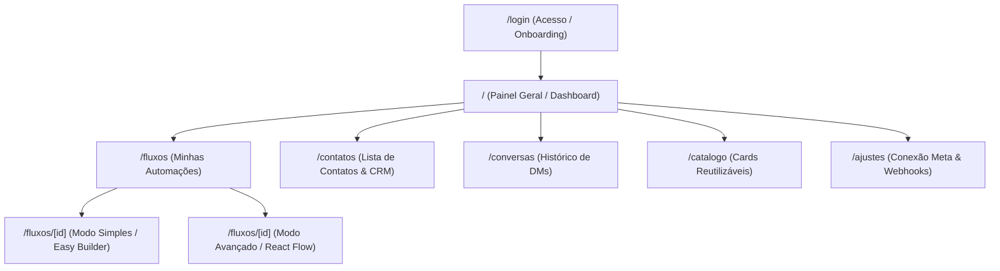

# DESIGN — Design System & Arquitetura Visual (Fluxo)

> **Documento de Design & UX/UI**  
> **Versão:** 1.0  
> **Design System:** Fluxo Design System (`design-system/`)  

---

## 1. Identidade Visual & Design Tokens

O Fluxo utiliza um tema minimalista, limpo e escuro/claro com alto contraste e foco em usabilidade.

### Paleta de Cores
- **Primary / Brand:** `#2563eb` (Azul Ação / Destaque)
- **Primary Hover:** `#1d4ed8`
- **Surface 100 (Background Geral):** `#09090b` (Dark) / `#f8fafc` (Light)
- **Surface 200 (Cards & Painéis):** `#18181b` (Dark) / `#ffffff` (Light)
- **Surface 300 (Inputs & Bordas):** `#27272a` (Dark) / `#e2e8f0` (Light)
- **Ink Primary (Texto Principal):** `#f4f4f5` (Dark) / `#0f172a` (Light)
- **Ink Muted (Texto Secundário):** `#a1a1aa` (Dark) / `#64748b` (Light)
- **Success / Live:** `#16a34a` (Verde Ativo)
- **Warning / Alert:** `#eab308` (Amarelo Alerta)
- **Danger / Error:** `#dc2626` (Vermelho Erro)

---

## 2. Mapa de Telas & Navegação

---

## 3. Componentes do Editor de Fluxos (`@xyflow/react`)

### 3.1 Caixinhas (Nós) Disponíveis
1. **Gatilho (`TRIGGER` - Verde):**
   - Entrada do fluxo.
   - Mostra tipo (Comentário, DM, Story) e lista de palavras-chave.
   - Saída única para o primeiro nó de ação.
2. **Mensagem (`MESSAGE` - Roxo/Azul):**
   - Envio de DM simples com até 1.000 caracteres.
   - Saída única.
3. **Pergunta com Botões (`QUESTION` - Laranja):**
   - Texto + até 3 botões fixos (`button template`).
   - Cada botão possui uma saída independente no canvas.
4. **Condição (`CONDITION` - Amarelo):**
   - Regra lógica (ex: "Segue o perfil?", "Tem tag X?", "Clicou no link?").
   - Saída dupla: `Sim (Verdadeiro)` e `Não (Falso)`.
5. **Espera / Delay (`DELAY` - Cinza):**
   - Intervalo de tempo (minutos/horas, máx. 23h).
   - Saída única.
6. **Aplicar Etiqueta (`ADD_TAG` - Azul Petróleo):**
   - Adiciona tag ao contato no banco.
   - Saída única.
7. **Carrossel (`CAROUSEL` - Rosa):**
   - Até 10 cards com imagem, título, descrição e botão.
   - Cada card com ação "postback" vira uma saída no nó.
8. **Follow Gate (`FOLLOW_GATE` - Ciano):**
   - Mensagem solicitando seguir o perfil com botão "DESBLOQUEAR".
   - Saída quando desbloqueado.

---

## 4. Estados de Interface (Zero Ambiguity)
- **Empty State:** Mostra ilustração e botão primário com CTA direto (ex: *"Nenhuma automação criada. Comece por uma Automação Rápida"*).
- **Loading State:** Skeletons animados com a mesma geometria dos cards e botões.
- **Save State (Autosave):** Indicador sutil no cabeçalho: `Salvando...` → `Salvo agora mesmo` ou `Erro ao salvar (tentar novamente)`.
- **Validation Alerts:** Badges de ⚠️ em caixinhas com campos incompletos antes da publicação.
