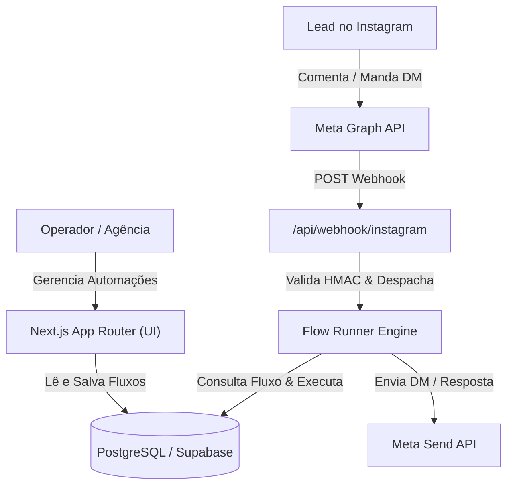

# PRD — Fluxo (Automação de Conversas para Instagram)

> **Documento de Requisitos do Produto (PRD)**  
> **Versão:** 1.0 (MVP)  
> **Status:** Aprovado para Reestruturação  
> **Autor:** Start Inc. / Pair Programming AI  

---

## 1. Visão Geral & Proposta de Valor
O **Fluxo** é uma plataforma proprietária de automação de conversas para o Instagram (alternativa enxuta e sem mensalidades abusivas ao ManyChat), projetada para criadores, agências e operações B2B.

### Problema Central
As ferramentas de mercado (como ManyChat tradicional) cobram mensalidades por volume de contatos que escalam rapidamente e possuem interfaces complexas com dezenas de recursos que 90% dos usuários não utilizam.

### Solução
Um sistema focado no fluxo de maior conversão do Instagram:
**Comentário em Post/Reel/Story → DM Automática com Botão Fixo → Confirmação de Seguidor → Entrega de Link/Catálogo → Lembrete de Recuperação.**

---

## 2. Personas e Casos de Uso

1. **Criador de Conteúdo / Infoprodutor:**
   - Publica um Reel com CTA: *"Comente CASAMENTO para receber o guia"*.
   - O sistema responde o comentário na hora e envia uma DM com o botão de acesso.
   - Caso o lead não siga o perfil, solicita que siga antes de desbloquear.

2. **Agência / Gestor de Tráfego:**
   - Cria automações rápidas para múltiplos clientes sem precisar de código.
   - Monitora conversas, etiquetas de leads e histórico de envios.

---

## 3. Escopo do MVP (O que o sistema DEVE fazer)

### Módulo 1: Conexão & Onboarding (Meta Graph API)
- [ ] Login/Conexão com conta profissional do Instagram via Facebook Login for Business.
- [ ] Armazenamento seguro de tokens de longa duração (`access_token`).
- [ ] Registro do Webhook do Instagram para recebimento de eventos em tempo real.

### Módulo 2: Editor de Automações (UI)
- [x] **Automação Rápida (Easy Builder):** Interface em linguagem natural para configurar em menos de 2 minutos (Gatilho → Resposta no Comentário → DM com Botão → Follow Gate → Link → Lembrete).
- [x] **Editor Visual Avançado (React Flow):** Canvas drag-and-drop para conectar nós:
  - Mensagem de texto.
  - Pergunta com até 3 botões fixos (`button template`).
  - Condição (If/Else: se segue, se tem tag, se clicou no link).
  - Delay (espera de tempo).
  - Aplicar/remover Etiqueta (`Tag`).
  - Carrossel de cards (`generic template`).
  - Follow Gate (Verificação de seguidor).
- [ ] Validação visual em tempo real de limites impostos pela Meta.

### Módulo 3: Motor de Execução (Engine Backend)
- [ ] Endpoint de Webhook `/api/webhook/instagram` com validação de assinatura HMAC SHA-256.
- [ ] Receptor de eventos:
  - `comments` (comentários em posts e reels).
  - `messages` (DMs recebidas).
  - `messaging_postbacks` (cliques em botões interativos).
- [ ] Roteador de gatilhos: busca fluxo ativo que bate com as palavras-chave configuradas.
- [ ] Executor de nós (`FlowRunner`): processa a árvore de nós passo a passo.
- [ ] Agendador de filas para nós de `DELAY` e lembretes (via cron/filas).

### Módulo 4: Rastreamento & Links Inteligentes
- [ ] Encurtador e redirecionador interno (`/api/l/[code]`) para registrar cliques em links e disparar lembretes se o lead não abrir.

### Módulo 5: CRM & Gestão de Contatos
- [ ] Cadastro automático de contatos com `igsid`, username e foto.
- [ ] Histórico completo de mensagens trocadas (`Message`).
- [ ] Gestão de etiquetas (`Tags`) aplicadas manual ou automaticamente.
- [ ] Painel com busca e filtros de contatos.

### Módulo 6: Segurança & Autenticação
- [ ] Proteção de rotas via `middleware.ts` com autenticação real (HTTP Basic ou Supabase Auth).
- [ ] Criptografia de tokens de acesso.

---

## 4. Fora do Escopo do MVP (O que NÃO fazer agora)
- ❌ Integração nativa com WhatsApp ou Telegram (fica para a v2.0).
- ❌ Inteligência Artificial generativa respondendo DMs em texto livre (chatbot aberto).
- ❌ Cobrança de assinaturas / Stripe (uso interno e de clientes diretos).
- ❌ Disparo em massa de broadcast para listas frias fora da janela de 24h.

---

## 5. Regras de Negócio & Limitações da Meta (Invariantes)

| Recurso | Limite da Meta | Comportamento do Fluxo |
| :--- | :--- | :--- |
| **Janela de Atendimento** | 24 horas após a última mensagem do contato | Delays e lembretes só são disparados se `now() - lastInboundAt <= 24h` |
| **Botões por Mensagem** | Máximo de 3 botões | Trava na interface e no schema de validação |
| **Tamanho do Botão** | Máximo de 20 caracteres | Validação automática e conversão para maiúsculas |
| **Tamanho da Mensagem** | Máximo de 1.000 caracteres | Contador de caracteres na interface |
| **Cards no Carrossel** | Máximo de 10 cards | Interface limita e impede duplicação |
| **Tipo de Botão** | Apenas Botões Fixos (`button template`) | **Nunca** usar `quick_reply` (que somem na tela) |

---

## 6. Arquitetura Técnica Recomendada

---

## 7. Critérios de Aceitação para o MVP
1. Comentar uma palavra-chave em um post real do Instagram e receber a DM configurada em menos de 3 segundos.
2. Clicar em um botão na DM e o sistema transitar para o próximo nó do fluxo sem duplicar mensagens.
3. Não quebrar caso o lead mande múltiplos comentários seguidos (idempotência via `igMessageId`).
4. Painel de automações seguro, responsivo e sem falhas de tipagem.
