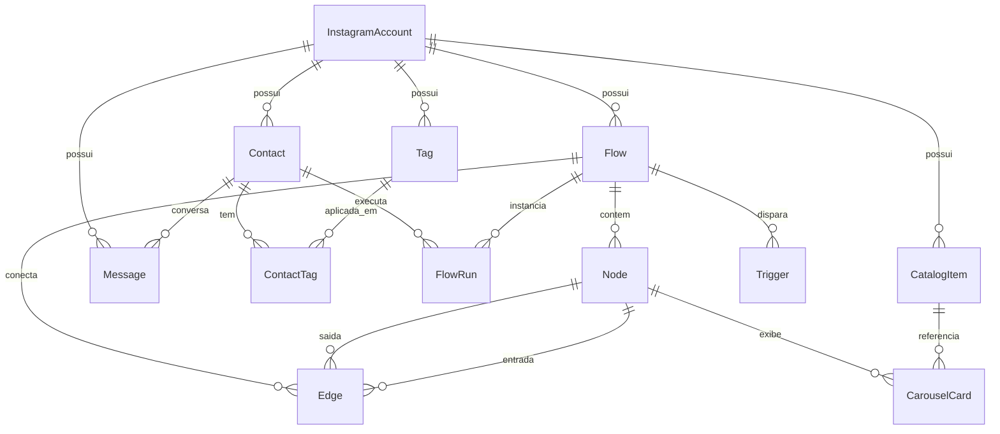

# SCHEMA — Arquitetura de Dados (Fluxo)

> **Documento de Modelagem de Banco de Dados**  
> **ORM:** Prisma v7  
> **Banco:** PostgreSQL (Supabase)  
> **Arquivo fonte:** `prisma/schema.prisma`  

---

## 1. Diagrama de Relacionamento de Entidades (ERD)

---

## 2. Tabelas Principais & Finalidades

### 1. `InstagramAccount`
- Representa o perfil do Instagram conectado.
- Campos vitais: `igUserId` (ID Meta), `username`, `accessTokenEnc` (Token Graph API), `status`.

### 2. `Contact`
- O usuário que interagiu com o perfil (lead).
- Campos vitais: `igsid` (ID do usuário no escopo da conta), `username`, `followsAccount`, `lastInboundAt` (crucial para checar a janela de 24h).
- Unique: `[accountId, igsid]`.

### 3. `Tag` e `ContactTag`
- Etiquetas para segmentação (ex: "lead-quente", "comprou-mentoria").
- `ContactTag` armazena qual fluxo aplicou a etiqueta (`appliedByFlowId`).

### 4. `Flow`, `Node` e `Edge`
- Estrutura gráfica do fluxo.
- `Flow.mode`: `SIMPLE` (gerado via receita declarativa) ou `ADVANCED` (desenhado livremente no canvas).
- `Node.data`: Armazena a configuração JSON específica de cada nó (`MESSAGE`, `QUESTION`, `CONDITION`, `DELAY`, etc.).
- `Edge.sourceHandle`: Identifica qual saída do nó originou a conexão (id do botão, "yes"/"no", etc.).

### 5. `Trigger`
- Regras que disparam o fluxo.
- `TriggerType`: `COMMENT_KEYWORD`, `DM_KEYWORD`, `STORY_REPLY`, `BUTTON_CLICK`.
- `publicReplies`: Variações de respostas públicas em comentários para evitar bloqueio por spam da Meta.

### 6. `FlowRun`
- Estado da execução de um fluxo por um contato.
- Status: `RUNNING`, `WAITING_DELAY`, `WAITING_CLICK`, `DONE`, `FAILED`.
- `resumeAt`: Data/hora exata em que o worker deve acordar a execução após um nó de `DELAY`.

### 7. `Message`
- Log completo de mensagens de entrada (`IN`) e saída (`OUT`).
- `igMessageId`: Chave única para garantir idempotência contra reenvios de webhook da Meta.
